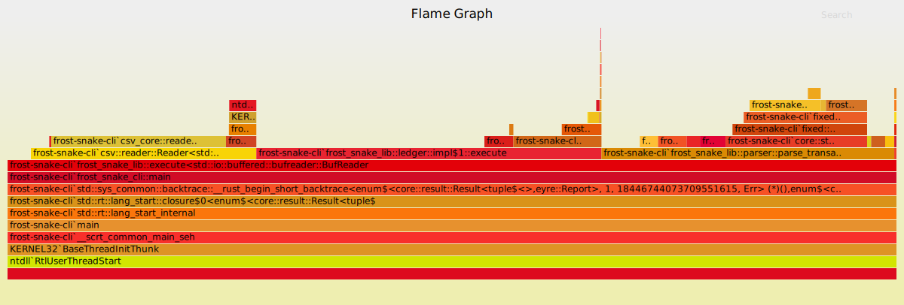

# Considerations while writing this implementation

For this code challenge I decided to primarily focus on writing a correct implementation and then optimizing it to process transactions as fast as possible.

Below I've written some of my considerations for the 5 rating criteria as well as some of the ambiguities I ran into and how I resolved them.

## Specification Ambiguity
Below is a list of the various things that either weren't described in the specification or were ambiguous along with how I've chosen to resolve them:

* Account locking/freezing is only specified as happening if a chargeback occurs but not what should happen to the following client transactions.

  I've chosen to interpret a locked account as disallowing withdrawals only. This is based on the logic that we'll allow the client to return the account to good standing (with manual intervention) after they deposit enough funds to cover the charged back amount.
  Disputes, chargebacks and resolves aren't something we can stop and such they'll be handled as normal.

* The specification doesn't mention how large of an account balance should be handled.

  One way to achieve this is using arbitrary precision crates like `num-bigint` or `fixed-bigint`.
  These types of crates would hinder performance, as a lot of extra work and memory is required to implement arbitrary precision arithmetic.

  I've opted to compromise and instead use 64 bit fixed point integers for currency handling as these are very fast. With a 16bit fraction they are also able to handle our 4 digits of precision in a range of +- 140 trillion.
  This should certainly be enough to cover even the largest of client accounts considering the world GDP of 2020 was 80 trillion USD and the Government Pension Fund of Norway (the worlds largest sovereign wealth fund) has around 1.35 trillion USD worth of assets.

## Completeness

All transaction types are fully handled.

## Correctness

I've put quite a lot of effort into checking the correctness by writing both unit tests as well as integration tests that run against all the provide input/output files in `crates/lib/tests/test-cases`.

Furthermore I've written a test data generator in `crates/generator` that can be invoked by running `cargo run -p frost-snake-generator > sample.csv`.

This generates sample data based on a weighted distribution of 50% deposits, 48% withdrawals, 1% disputes, 0.5% resolves and 0.5% charge backs. These weights are mostly just arbitrary numbers that seemed realistic. The generator should produce correct data in the sense that it follows the specification and does not generate invalid transactions.

The large 100k transaction files have not been fully checked for correctness. Instead the `cli` was used to calculate the output and then manually checked a few of the output entries for correctness.

Another way I've strived to achieve correctness is by making `ClientAccount` derive `Clone+Copy`.
This together with the various transaction handling methods taking a `self` rather than mutable references helps prevent partial execution a fallible actions on the account where some part is mutated
and then something fails without reverting the previously mutated state.
An example of this could be the `resolve` action which first adds to the available amount and then
subtracts from the held amount. The subtraction of held has the possibility of underflowing which would
leave the account with duplicated funds in the available and held amounts which is very bad.

Furthermore the output column `total` was implemented as a computed field. The main reason behind this was to minimize the `ClientAccount` code as fewer lines has fewer possibilities of bugs.
One could argue the total field can be used as extra error checking but that would indirectly lead to code
duplication since for deposit and withdrawal the subtraction/addition would be mirrored on the total field.
And in the future a lazy developer might be tempted to fully recompute the field and loose out on the error
checking.
For inputs where the number of transactions per client is high it also provides a speed benefit to only compute the total amount at the end and not having to copy an additional 8 bytes for every transaction.

## Safety and Robustness

There are no instances of unsafe code in the crate. The main point of risk is in the `Ledger::execute` function as one need to be sure to not overwrite the mutable state.

Another risk is adhering 100% to the specification in terms of not double checking that `tx` ids are globally unique. They are only checked on a per client basis but hopefully that should handle most of the danger in terms of being resilient against replay attacks.

## Efficiency

The generator was mostly used as a tool for benchmarking the code with `criterion` as can be seen in `crates/lib/benches` which can be run with `cargo bench`. The code was also profiled using flamegraph.

I've gone through multiple optimization passes. Initially the code was using `im-rc` for immutable hashmaps in order to improve correctness by preventing accidentally overwriting client account data on errors, as explained in the resolve example above. In this version the `ClientAccount` owned the deposits.

That turned out to be horrendously inefficient in terms of both memory usage and cpu time.
As such I switched to regular `std` hashmaps and moved the deposit tracking out to the `Ledger`. However in order to keep the transaction execution as safe as possible `ClientAccounts` are still `Clone + Copy` and I perform our computations a copy of the client. The new state is then only assigned on a successful transaction execution.

This yielded a significant improvement but it turns out that the `csv` crate's serde implementation is both lacking in features and slow. After optimizing the transaction execution the CSV parsing was taking in excess of 75% of the total execution time.

As a consequence I rewrote the implementation to use the `read_byte_record()` API of csv. This comes with the tradeoff that the parser *only* supports ASCII input, but given the data format specified and the large 40-50% throughput increase it yielded, it's well worth the limitation.

Another large throughput gain was achieved by disabling the string trimming of the `csv` parser.
For some unknown reason enabling trimming causes a large amount of allocations to happen.
So it was handled by calling `trim` on the `AsciiStr` for each field instead which nearly doubled the performance.

With all of these optimizations the program more than quadrupled it's throughput according to `criterion` as it went from around 15 million transactions per second to ~63 million.

Below an example of the final version's flamegraph processing a ~3GB file with a 100 million transactions in ~5 seconds can be seen:

## Maintainability

Due to the optimizations above the program isn't the most beautiful or maintainable ever. However as with all engineering it's a tradeoff and in this case I thought demonstrating the performance optimizations would be more interesting.

One example where the maintainability has suffered the most is in the serialization and deserialization department as it's vastly simpler to add another field to a `serde` derived struct than it is to add more fields to the fairly custom parsing logic.
